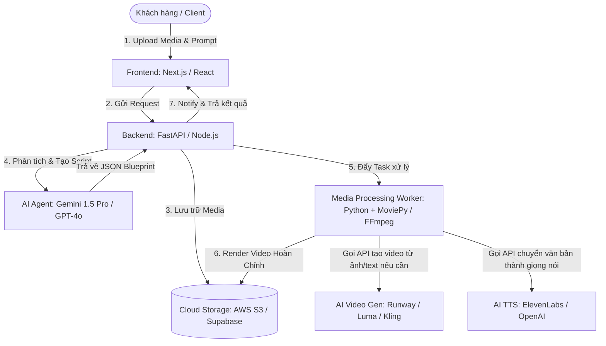

# Kế hoạch Triển khai: Hệ Thống Tự Động Hóa Tạo Và Chỉnh Sửa Video Bằng AI

Mục tiêu chính của hệ thống này là tạo ra một nền tảng SaaS hoặc sản phẩm dạng White-label mà bạn (một nhà phát triển IT) có thể quản lý dễ dàng bằng Git, cấu hình nhanh chóng qua biến môi trường để triển khai và bán cho nhiều khách hàng khác nhau. 

Người dùng chỉ cần đưa hình ảnh/video thô và nhập câu lệnh tự nhiên (Prompt). AI sẽ tự động phân tích, dịch câu lệnh thành cấu trúc kịch bản biên tập (JSON Blueprint) và thực thi biên tập (cắt, ghép, chèn nhạc, lồng tiếng, tạo phụ đề) thành video hoàn chỉnh.

---

## Kiến Trúc Hệ Thống Đề Xuất (System Architecture)



Hệ thống hoạt động theo mô hình bất đồng bộ (Asynchronous Queue) để tránh quá tải hoặc timeout khi render các video nặng:
1. **Frontend**: Nhận file và prompt của người dùng, gửi đến Backend.
2. **Backend**: Upload file lên Cloud Storage, tạo một bản ghi nhiệm vụ (Task) trong Database và đẩy task vào Message Queue (Redis / Celery).
3. **AI Agent**: Gọi LLM (Gemini 1.5 Pro/Flash) để phân tích yêu cầu biên tập và xuất ra cấu trúc chỉ thị biên tập dạng JSON (JSON Blueprint).
4. **Worker**: Nhận JSON Blueprint, tải tài nguyên thô, gọi các API phụ (TTS, Video Gen nếu có), thực hiện biên tập thông qua thư viện xử lý video (MoviePy/FFmpeg) và xuất bản video cuối cùng lên Storage.
5. **Real-time Status**: Frontend sử dụng WebSocket hoặc Polling để cập nhật tiến độ render cho người dùng theo thời gian thực.

---

## Lựa Chọn Công Nghệ (Tech Stack)

Để tối ưu hóa hiệu năng xử lý media, chi phí vận hành và tính đóng gói cao, các công nghệ sau được khuyến nghị:

| Lớp (Layer) | Công nghệ đề xuất | Lý do lựa chọn & Khả năng đóng gói |
| :--- | :--- | :--- |
| **Frontend UI** | **Next.js (React)** + Tailwind CSS | Giao diện quản trị & dashboard hiện đại. Dễ dàng tùy biến nhận diện thương hiệu (logo, màu sắc) cho từng khách hàng thông qua cấu hình tập trung. |
| **Backend API** | **FastAPI (Python)** | Chạy async hiệu năng cao. Python là môi trường lý tưởng để thao tác với các thư viện AI và xử lý video. |
| **Xử lý Video (Media Engine)** | **MoviePy** & **FFmpeg** | Bộ thư viện mã nguồn mở mạnh mẽ nhất giúp cắt ghép, scale, chèn chữ, lồng tiếng, ghép transition trực tiếp bằng code Python mà không tốn chi phí bản quyền. |
| **Trí tuệ nhân tạo (LLM Agent)** | **Gemini 1.5 Flash/Pro API** | Context window lớn (lên tới 2M tokens) cho phép đưa trực tiếp video/âm thanh thô vào prompt để AI phân tích cảnh. Hỗ trợ Structured Outputs (trả về JSON chuẩn 100%). Chi phí API cực kỳ rẻ. |
| **Tạo Video tự động (AI Video)** | **Runway Gen-3** hoặc **Luma Dream Machine API** | Dùng để sinh clip ngắn (4s - 8s) từ hình ảnh tĩnh hoặc text prompt do người dùng cung cấp. |
| **Giọng nói & Phụ đề** | **ElevenLabs / OpenAI TTS** & **Whisper** | Chuyển văn bản thành giọng đọc tự nhiên (lồng tiếng AI) và tự động tạo phụ đề chạy khớp từng mili-giây với giọng nói. |
| **Cơ sở dữ liệu & Storage** | **Supabase (PostgreSQL + S3 Storage)** | Setup cực nhanh, tích hợp sẵn Auth, Database, Storage. Có gói miễn phí rộng rãi cho việc phát triển và chạy thử nghiệm. |
| **Đóng gói & Phân phối** | **Docker & Docker Compose** | Đóng gói toàn bộ backend, worker, môi trường FFmpeg vào container để deploy lên bất kỳ VPS nào chỉ bằng 1 câu lệnh. |

---

## Quy Trình Xử Lý Của AI Agent (AI Editing Pipeline)

Điểm mấu chốt của hệ thống là khả năng chuyển ngữ cảnh tự nhiên thành các chỉ thị cắt ghép cụ thể. Quy trình diễn ra như sau:

### 1. Phân tích nội dung thô (Media Analysis)
Khi người dùng upload ảnh hoặc video thô, AI Agent (sử dụng Gemini 1.5) sẽ phân tích:
- Video có nội dung gì? Gồm những cảnh nào? (Ví dụ: Cảnh 1 từ 0s-5s là bãi biển, Cảnh 2 từ 5s-10s là người đang đi bộ).
- Tone giọng, chủ đề của video để chọn nhạc nền phù hợp.

### 2. Tạo JSON Blueprint (Edit Decision List)
Dựa trên phân tích thô và Prompt yêu cầu của người dùng, AI Agent sinh ra một cấu trúc JSON chi tiết mô tả kịch bản biên tập:
```json
{
  "canvas": { "width": 1080, "height": 1920, "fps": 30 },
  "audio": {
    "background_music_url": "https://supabase-storage/music/upbeat_tech.mp3",
    "bgm_volume": 0.15,
    "voiceover": {
      "enabled": true,
      "text": "Hãy cùng khám phá tính năng mới của ứng dụng trong video này nhé!",
      "voice_id": "rachel"
    }
  },
  "timeline": [
    {
      "type": "video",
      "source_url": "https://supabase-storage/uploads/user_video_raw.mp4",
      "trim_start": 2.5,
      "trim_end": 7.0,
      "text_overlay": {
        "text": "TÍNH NĂNG MỚI",
        "font_size": 60,
        "color": "#FFFFFF",
        "position": "center"
      },
      "transition_out": "crossfade"
    },
    {
      "type": "image_to_video",
      "source_url": "https://supabase-storage/uploads/product_photo.jpg",
      "ai_prompt": "cinematic zoom in camera motion of the tech gadget",
      "duration": 4.0,
      "transition_out": "fade"
    }
  ]
}
```

### 3. Thực thi Render biên tập (Video Generation)
Worker Python nhận JSON này:
- Nếu `voiceover.enabled` là true: Gửi văn bản tới ElevenLabs/OpenAI TTS để tạo file âm thanh lồng tiếng, đồng thời dùng Whisper hoặc thông tin timeline của TTS để tạo file phụ đề SRT/VTT.
- Nếu gặp clip có type `image_to_video`: Gọi API Runway để generate clip động từ ảnh tĩnh.
- Gọi thư viện `MoviePy` để cắt ghép các phân đoạn video, áp dụng transition, chèn text overlay, lồng tiếng và trộn nhạc nền theo cấu trúc chỉ định.
- Xuất file video hoàn chỉnh (.mp4) và lưu lên Storage.

---

## Chiến Lược Quản Lý Trên Git & Đóng Gói Bán Hàng (White-label & Monetization)

Là một lập trình viên IT, bạn cần thiết kế hệ thống sao cho việc phân phối cho khách hàng dễ dàng và có thể tái sử dụng tối đa code của mình:

```
/ai-video-automation (Git Repository)
├── /frontend          # Next.js App
│   ├── /src/config    # brand.config.ts (Cấu hình Logo, Tên Web, Màu sắc)
│   └── ...
├── /backend           # FastAPI App (API & Database models)
├── /worker            # Python script xử lý video & kết nối AI APIs
├── .env.example       # File mẫu chứa toàn bộ API keys và config
├── Dockerfile.backend
├── Dockerfile.worker
└── docker-compose.yml # File khởi chạy nhanh cả hệ thống
```

### 1. Quản lý Nhánh Git (Git Branching Strategy)
- **Nhánh `main`**: Chứa mã nguồn cốt lõi (Core Product). Mọi tính năng mới, nâng cấp AI, sửa lỗi chung sẽ được phát triển trên nhánh này.
- **Nhánh `client/*`** (Ví dụ: `client/khach-hang-A`, `client/khach-hang-B`): Khi bạn bán code hoặc deploy cho một khách hàng cụ thể:
  1. Tạo một nhánh mới từ `main` (`git checkout -b client/khach-hang-A`).
  2. Thay đổi logo, cấu hình màu sắc thương hiệu trong `/frontend/src/config/brand.config.ts`.
  3. Cấu hình file `.env` chứa API keys và thông tin kết nối DB của riêng khách hàng đó.
  4. Nếu khách hàng có yêu cầu sửa đổi tính năng riêng, bạn lập trình trực tiếp trên nhánh này.
  5. Khi nhánh `main` có cập nhật tính năng mới hoặc vá lỗi bảo mật, bạn chỉ cần thực hiện `git checkout client/khach-hang-A` và `git merge main` để cập nhật hệ thống cho họ mà không làm mất các chỉnh sửa giao diện riêng.

### 2. Thiết kế Cấu hình Tập trung (Centralized Configuration)
Tất cả các tham số cấu hình hệ thống phải được đọc từ biến môi trường (`.env`), bao gồm:
- API Keys: `GEMINI_API_KEY`, `RUNWAY_API_KEY`, `ELEVENLABS_API_KEY`.
- Database & Storage: `SUPABASE_URL`, `SUPABASE_SERVICE_ROLE_KEY`, `SUPABASE_BUCKET_NAME`.
- Brand details: `BRAND_NAME`, `BRAND_SUPPORT_EMAIL`.

### 3. Triển khai Nhanh bằng Docker
Khi bàn giao sản phẩm, bạn chỉ cần bàn giao mã nguồn cùng tệp `docker-compose.yml`. Khách hàng chỉ cần chuẩn bị một máy chủ (VPS Ubuntu), cài Docker và thực hiện lệnh:
```bash
docker-compose up -d --build
```
Hệ thống sẽ tự động build frontend, backend, worker, cài đặt môi trường FFmpeg cần thiết và khởi chạy ứng dụng.

---

## Kế Hoạch Xác Minh & Kiểm Thử (Verification Plan)

Để đảm bảo hệ thống hoạt động ổn định và chất lượng video đầu ra tốt nhất, chúng ta cần kiểm thử qua các bước:

### 1. Kiểm thử Tự động (Automated Tests)
- **JSON Parser Test**: Viết unit test trong Python để đảm bảo parser đọc đúng các thông số JSON Blueprint và phát hiện lỗi cú pháp (ví dụ: file media không tồn tại, thời gian trim không hợp lệ).
- **Mocking API Test**: Tạo các mock test cho API ElevenLabs và Runway để chạy thử nghiệm pipeline tạo video mà không tốn chi phí gọi API thật.

### 2. Xác minh Thủ công (Manual Verification)
1. Truy cập giao diện dashboard, thực hiện upload 2 ảnh và 1 video ngắn dài 10 giây.
2. Nhập yêu cầu biên tập: *"Hãy cắt video ngắn còn 5 giây đầu, ghép thêm 2 hình ảnh tiếp theo, lồng giọng thuyết minh giới thiệu sản phẩm bằng tiếng Việt ấm áp, thêm nhạc nền công nghệ nhẹ nhàng và chèn phụ đề khớp giọng nói."*
3. Đợi quá trình render hoàn tất và kiểm tra kết quả:
   - Video đầu ra có hiển thị đúng thời lượng và thứ tự các cảnh không?
   - Giọng đọc AI thuyết minh có tự nhiên không? Phụ đề hiển thị trên màn hình có khớp khớp từng chữ với giọng đọc không?
   - Nhạc nền có được giảm âm lượng tự động khi có giọng đọc thuyết minh để tránh bị lấn át không?
   - Tỉ lệ khung hình (ví dụ 9:16) có hiển thị chuẩn trên thiết bị di động không?
